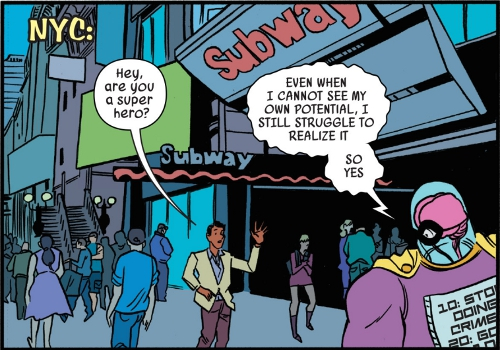
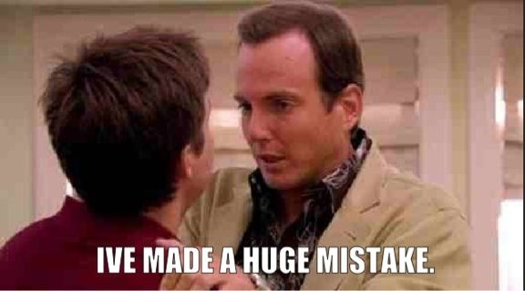
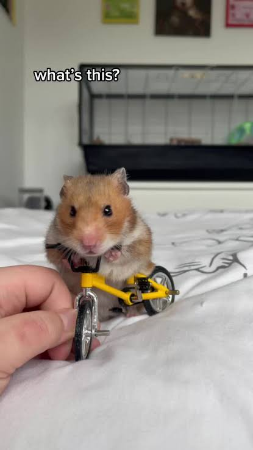

## Welcome!

Hello, and welcome to the first ever edition of *All the Right Questions:* The new monthly (??) newsletter for Church Army staff in which we think together about how we can get, share and use the data that we need to do the work that God has called us to. The format is still evolving, but I'm hoping to use this space to signpost resources, celebrate successes and remind you all that I exist and that I care about your professional relationship with data.

Thanks so much for joining me here. If you've got any questions, or if there's anything you'd like to see covered in a future edition of *ARQ*, please let me know! Drop me an email (I'm david.lovell), or just come and say hi to me at my desk.

This newsletter isn't an official Church Army publication and as such it doesn't represent the views of Church Army. Just me, Data Dave.

## This week:

-   [A promotion](#sec-promotion): Church Army Survey Design Training
-   [The Big Idea](#sec-big-idea): Saying 'Yes And' to our funders (with data!)
-   [The blunder](#sec-blunder): Failure to compare
-   [The lesson](#sec-lesson): Statistics is a little hamster on a tiny bicycle
-   [The puzzle](#sec-puzzle): A tricky Connections that's *very* tenuously related to this week's newsletter.

## A promotion: Come and learn how to do surveys! {#sec-promotion}

I've been making surveys for nearly a decade now. I've made some top-tier ones, but I've also made some awful guffs along the way. This Autumn, I'm going to be running a survey design workshop for my colleagues in the mission support team. Come and learn from all my mistakes! Exact dates to be confirmed, but the content will cover *at least* the following:

-   Designing purposeful surveys
-   Formalising big questions that mean something
-   Building effective survey items
-   Understanding bias and avoiding it
-   Not doing anything wrong or illegal in your survey

Expect plenty of chat, lots of examples and no small amount of real-time survey design. It's going to be an absoulte blast, and definitely more interesting than your actual job. Details to follow in future editions of *ARQ*. If you're interested, please let me know because it would be a great encouragement to me.

{fig-alt="Brain Drain is my celebrity crush real talk"}

## The big idea: Saying 'Yes And' to our funders {#sec-big-idea}

I had a really exciting conversation an the Mission Support Team day on Tuesday. I was talking to someone who manages a project, and they were telling me that the project stakeholders were asking the wrong questions (or at least, they weren't always asking *all the right questions*).

{fig-alt="Arrested Development's Michael Bluth saying 'Hey, that's the name of the newsletter'"}

I was absolutely thrilled, and it helped me to put my finger on something that had been bothering me: Very often there is little-to-no critical engagement with stakeholder requirements for the quantitative reporting around a project. The stakeholder says, "Please measure X" and we say, "Okay we'll ask our data guy to make it happen."

At one level, that's totally understandable: Oftentimes our stakeholders are really invested in one Big Number, and getting their money means promising to make the Big Number go up. It's beyond the scope of this newsletter to evaluate whether that's a good way of managing projects at a national level. That's simply the funding environment we're living in, which means that when a funder says, "Please measure X", we probably don't want to say "No, sorry."

But we can say, "*Yes, and...*"

> *Yes*, we can measure the number of new disciples, *and* we can measure the number of young people who say that have more joy and/or peace because of Jesus

> *Yes*, we can measure self-reported confidence in evangelism, *and* we can ask participants if they have become more imaginative, hopeful or prayerful in their evangelism.

Whatever the benefits of having a Big Number may be, there are certainly pitfalls. In my experience, people are often cynical about the realisation of targets which appear to have been 'pulled out of thin air'. At worst, quantitative impact reporting can become something of a box-ticking exercise - a necessary evil about which nobody is particularly excited. In that context, saying "*Yes, and..."* can communicate a number of important things:

1.  It communicates that we are sincerely invested in the aims of the project. We really do want new disciples and confident evangelists! Asking better questions and sharing richer data shows that we desire to understand and celebrate the reality represented by the Big Number, rather than the number for its own sake.
2.  It demonstrates our expertise. When we tell stakeholders what we would like to measure, we show them that we understand our work and the value that it adds, and that we can not only deliver the projects objectives but also help them to understand the project's impact more deeply.
3.  It builds understanding and trust. And whatever happens to the Big Number, it's often the things we can't measure - things like understanding and trust - that really get things done.

## The Blunder: Failure to compare {#sec-blunder}

This is a new segment I'm trying out in which I reflect on a blunder I've made. I normally make at least one blunder a month, but if you've made any big blunders that are tenuously connected to data, hit me up. If you're featured I'll buy you a coffee (or something).

Comparing is easy to do. Lots of us are doing it all the time and don't really know how to stop. But sometimes comparing is difficult! This month's blunder is about a time I failed to think about comparison.

I was working with the Training and Equipping team on a survey of training alumni, and we realised that we're often talking about how Church Army's initial training is more accessible for people who haven't been through higher education, but that we don't have any crunchy numbers to support our anecdotal understanding. The survey would be a great opportunity to ask people about their highest qualification prior to their training with Church Army. By coding the responses by national qualification level, we could build an objective indicator of qualification levels. Very exciting.

The survey closed. The results were in. They didn't really tell us anything.

{fig-alt="Job Bluth saying 'I've made a huge mistake.'"}

Some trainees didn't have a uni degree, but lots of them did - more, in fact, than the population average. But what does that really mean? After all we were surveying from a group of people who had decided to undertake additional training, some of which would be unavoidably academic. Did I really expect this group to have fewer previous qualifications that the population average.

A little though revealed my mistake: I had ignored an implicit comparison. When we say that we offer training that's more accessible for people without academic qualifications, what we mean is that it's *more accessible than other forms of theological education*. What we needed to do was to compare Church Army trainees to vicars-in-training at the various Vicar Schools (not a real term) across the Church of England. If our trainees were more academically qualified than the average would-be-vicar, that would plainly contradict the way that we understand and articulate ourselves. Sadly there isn't great data on would-be-vicars at the moment, but I am assured that the vicar schools are working on it.

## The lesson: Statistics as model making {#sec-lesson}

Welcome to the statistics-lesson part of *ARQ*. If you've made it this far you're a big dork and it's too late to go back. Welcome to after-school statistics club.

This week, we'll be looking at a really important fundamental idea that's often skipped right over when we think about statistics. You probably don't need to understand it to do your job, but I hope that it will equip you to think critically and carefully about statistics of all kinds.

Imagine you've just finished watching a bike race, and you think that the winner was cheating by taking performance-enhancing supplements. You decide to test this theory, so you head to the pet shop buy a hamster, for whom you build a tiny bike:

{fig-alte"A picture of a hamster on a bicycle"}

You construct a to-scale velodrome for your hamster and his tiny bike, then you give him an appropriate dose of performance-enhancing supplements. You decide that if your hamster's time is closer to the winning cyclist's time than to the other riders, then you've proven the winner had taken the supplements.

Congratulations, you've just conducted your first statistical test by creating your first statistical model. Any attempt to 'prove' something with statistics uses - in one way or another - hamsters on tiny bicycles.

For a more orthodox example, imagine that you're flipping a coin repeatedly for fun. After 10 flips, you've had 8 heads and 2 tails. That seems fishy to you. That's too many heads.

Functionally, what you're doing here is putting forward a hypothesis: This coin is a *freaky coin*. It comes up heads too often. This statement implies a comparison with a *normal coin*. You don't have a normal coin on you, but you don't need one, because you create a mental model of a normal coin with almost no effort. Your mental model of a normal coin comes up heads about half the time. In ten flips, you'd expect to see five or six heads, maybe seven. But *eight*? That's too many. That's very improbable. So you reject the hypothesis that this coin is normal, and conclude that it is freaky, because you imagined a normal coin and it didn't come up heads that many times.

None of that is particularly well formalised or conclusive, but none of it is categorically different from 'proper' statistical testing. Let's do some proper testing now by flipping a coin ten times one million times, using the computer:

``` r
# ~~ R ~~
# We will simulate 1,000,000 times 10 'normal' coin flips
pretend_flips <-
  rbinom(n = 1e6,    # one million tests,
         size = 10,  # ten flips,
         prob = 0.5)  # normal coin)

## How many times did we get 8 or more heads?
number_of_times_we_got_8_heads_or_more <- sum(pretend_flips >= 8)

## What proprotion of our million flips?
proportion_8_heads <- number_of_times_we_got_8_heads_or_more/1e6

## Make a pretty percentage
paste0(
  round(proportion_8_heads, 3) * 100, 
  "%")
#> [1] "5.5%"
```

<sup>Created on 2026-07-09 with [reprex v2.1.1](https://reprex.tidyverse.org)</sup>

Our ten-times-ten-million flips gave us 8 or more heads 5.5% of the time. So is a coin that flips 8 heads out of 10 a freaky coin? The truth is we can't really say. All we can really say is something like:

"If our model of a normal coin accurately reflects the behavior of a normal coin in real life, then there's only a 5.5% chance that a normal coin would give 8 out of 10 heads. So there's a 94.5% chance that our coin is freaky."

Let's consider our mouse on a bicycle again. It wasn't a very good statistical test, and you can probably think of several shortcomings. But the one I want to call your attention to is this: What if a tiny mouse on a tiny bike in a tiny velodrome who's taken a tiny amount of performance-enhancing supplements doesn't accurately represent a human cyclist on a normal bike in a full-sized velodrome? If our model does not represent reality, then none of the other numbers mean anything. This is a true for a mouse on a bike as it is for simulated coin flips or online surveys.

I hope you've enjoyed this month's lesson. Join us next week as we scrutinise the notion of statistical significance and investigate the possible properties of our potentially-freaky coin.

## The Puzzle {#sec-puzzle}

I'm very happy with [this connections puzzle](https://connections.swellgarfo.com/game/-OxaHEufUlsD9Y12hnkT), but I can't promise anyone is going to enjoy it.